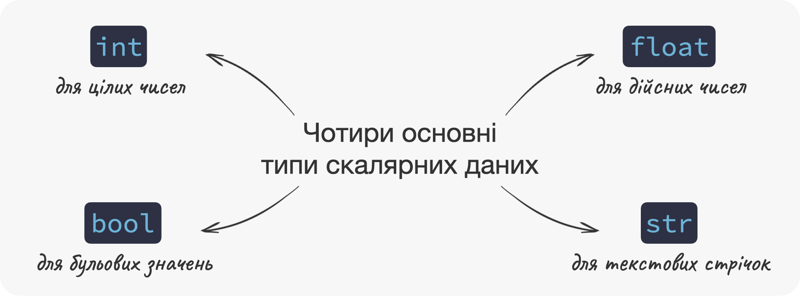
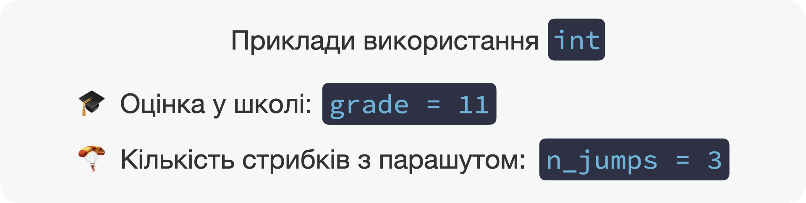
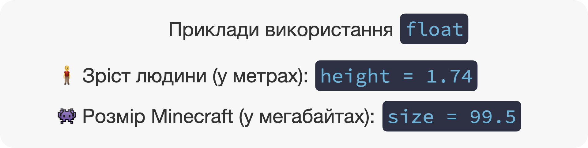
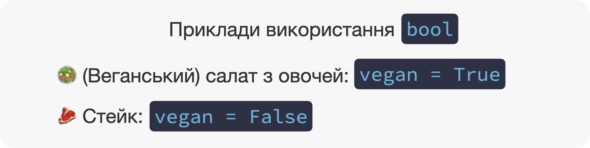
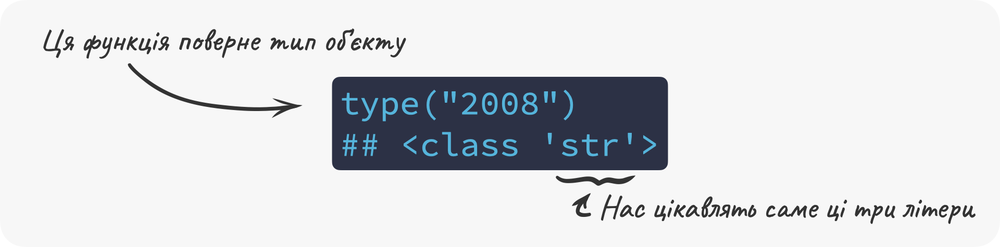
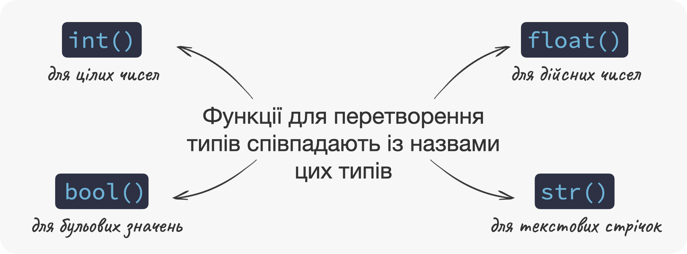

# (PART\*) Типи та структури даних {-}

# Типи скалярних даних {#scalars}

<div class="btn-group">
  <button class="lecture" onclick="location.href='https://youtu.be/bF1h_ftJxlk';">🎥 Лекція</button>
  <button class="podcast" onclick="location.href='https://podcasters.spotify.com/pod/show/irudnyts/episodes/6-e2a3sif';">🎙️ Подкаст</button>
  <button class="notebook" onClick="parent.open('https://colab.research.google.com/drive/1StQnIt-ykmzunPCT92mUpvS8GAJ68YIt?usp=sharing')">📓 Записник</button>
  <button class="exercises" onclick="openDetailsById('scalars_exercises');">🤸 Вправи</button>
  <button class="cheat" disabled>📝 Шпора</button>
</div>

**⏱️ Час на опанування теми:** 25 хвилин

**🤷 Для чого ми це вивчаємо:**

- Відрізняти різні типи скалярних даних
- Вибирати тип скалярних даних відповідно до завдання

**🔑 Результати навчання:**

- Створювати змінні з одним з чотирьох основних типів скалярних даних
- Визначати тип даних скалярного об'єкта 
- Перетворювати один тип скалярних даних на інший

```{r, echo=FALSE, message=FALSE, warning=FALSE, error=TRUE}
#-------------------------------------------------------------------------------
# Code below is for knit caching purposes

library(reticulate)
library(jsquiz)
source("term.R")

# set up all messages 
set_button_label("Перевірити")
set_placeholder("Пишіть тут...")
set_success_messages(
    c(
        "Так тримати, чемпіон 🌟",
        "Просто супер 🤩",
        "Ти -- молодец 😎",
        "Йой, бачу довідченого кодера 🤓",
        "А ти точно не прцював в OpenAI до цього 🤖"
    )
)
set_failure_messages(
    c(
        "Упс, ще трошки 😬",
        "Це не зовсім те, що ми мали на увазі, але вже близько 🙊",
        "Ти ще на один крок ближче до успіху, тільки не здавайся 🚀",
        "Нічого, головне не здаватися 💪"
    )
)
```

---

У цій главі ми розберемося з простими `r term("типами даних", "data types")`. Розглянемо ми тільки ті типи даних, які активно використовуються в науці про дані та машинному навчанні, а саме типи `int`, `float`, `bool` та `str`. Ми навчимося створювати об'єкти з такими типами даних, визначати типи даних об'єктів та змінювати типи з одного на інший.

---

## ☝ Розбираємось в скалярах 

У попередніх главах, ми створювали змінні, які вказували на об'єкти з **одним** єдиним значенням. Такі об'єкти ми будемо називати `r term("скалярами", "scalars")`.^[Тобто якщо об'єкт містить більше одного значення, то це вже не скаляр.] Дотепер, ми розглядали скаляри, які містили тільки числові значення 🔢. Цим типом скаляри не обмежуються. Ми можемо також створити скаляри, які будуть містити текстові  🔡 (наприклад: `"I love machine learning"`, `"apple"`) та `r term("бульові", "boolean")` значення (наприклад, `True` та `False`). Що таке бульові значення, ми дізнаємось трохи згодом.

В цій главі, ми розберемо тільки найважливіші типи скалярних даних. Тип даних -- це те, як мова програмування буде інтерпретувати дані. Наприклад, значення `3.14` може зберігатися в об'єкті з типом, який дозволяє математичне додавання ➕ та віднімання ➖ цього значення. З іншого боку, ми можемо використати тип даних, який дозволить приєднати текст `" - це число pi"` до цього значення. Але це все згодом, зараз ми повинні запам'ятати чотири основні типи:

- `int`: тип даних для цілих чисел
- `float`: тип даних для дійсних чисел
- `bool`: тип даних для бульових значень
- `str`: тип даних для текстових стрічок

Існують ще більш екзотичні, такі як `complex`, `bytes`, `NoneType`, але вони зараз нам не знадобляться. До одного з них ми повернемось у наступних главах, коли він будуть використовуватись. А зараз почнемо ми саме з того, що ми вже бачили -- чисел, які представлені у Python типом даних `int` та `float`.

```{r, echo=FALSE, out.width="100%"}

```

## 🔢 Використовуємо тип `int` для цілих чисел

Цілі числа -- це ті числа, які не мають дробової частини.^[Як колишній викладач вищої математики, можу сказати, що це дуже кепське визначення. Проте, воно дуже і дуже зрозуміле, що є головним зараз.] Наприклад: `0`, `-112342345`, `25` тощо. Число `3.51234` має дробову частину, тому воно вже не ціле. Для зберігання цілих чисел ми будемо використовувати тип даних `int`.^[Назва `int` -- це скорочення від integer, яке з англійської перекладається як раз як ціле число.]

Створювати об'єкти з цим типом дуже просто -- треба безпосередньо зазначити саме число:

```{python}
age = 16 # змінна age містить вік студента
age
```

Якщо ж ми хочемо зазначити від'ємне число, то нам треба поставити знак `-` на початку нашого числа: 

```{python}
challenger_deep = -10935 # змінна challenger_deep містить найглибшу точку
                         # на Землі у метрах відносно рівня моря
challenger_deep
```

Тип `int` ідеально підходять для змінних, які містять кількості: кількість стрибків з парашутом 🪂, кількість квартир в будівлі 🏙️ тощо. Також цей тип підходить для оцінок у школі, віку, поверху квартири тощо.

```{r, echo=FALSE, out.width="100%"}

```

## ⛵️ Використовуємо тип `float` для дійсних чисел

Якщо ж число має дробову частину, то ми його можемо представити за допомогою типу `float`. У Python задля десяткового розділювача використовується крапка `.` замість звичної для нас коми `,`. Іншими словами, число `3,7` буде представлено як `3.7`.

<div class = "warning">
🎈 **Увага**: використання пробілу до або після десяткової крапки викличе помилку! 
</div>

Створювати скаляри типу `float` легко, нам треба безпосередньо записати число:

```{python}
ugly_number = 3.2342523432487324 # змінна ugly_number містить некрасиве число
ugly_number
```

Ми можемо використовувати тип `foat`, наприклад, для зберігання температури 🌡️ пацієнта `36.6` або ціни 🏷️ `23.99`. До речі, ми можемо також зберігати й цілі числа. Для цього ми поставимо крапку і нуль після цілої частини:

```{python}
nice_number = 25.0 # змінна nice_number містить гарне число
nice_number
```

З точки зору математики, `25` як мало значення `25`, так і матиме. А ось з точки зору програмування `25` та `25.0` є об'єктами з різними типами даних.

```{r, echo=FALSE, out.width="100%"}

```


## 🐂 Використовуємо тип `bool` для бульових значень

Об'єкти типу `bool` можуть приймати два значення: або `True` або `False`. З англійської, `True` -- істина, `False` - хибність. Ми використовуємо цей тип скалярів для даних, які можуть прийняти тільки два значення. Наприклад, телевізор 📺 може бути **увімкненим** або **вимкненим**. Зараз може бути або **день** ☀️ або **ніч** 🌙. Літак ✈️ може прилетіти **вчасно** або **запізнитись**.

Розглянемо останній приклад зі змінною, яка містить інформацію чи запізнився літак ✈️. Ми можемо "закодувати" цю змінну наступним чином. Якщо літак запізнився, то вона матиме значення `True`, якщо ж прилетів вчасно -- тоді `False`. Давайте тепер створимо змінну з ім'ям `is_delayed`, і запишемо в неї значення, яке відповідає випадку коли літак запізнився, тобто `True`: 

```{python}
is_delayed = True
is_delayed
```

Звичайно, ви можете посперечатися, що ту ж саму інформацію можна закодувати за допомогою `int`. Скажімо, змінна матиме значення `1` коли літак запізнився і `0` коли прилетів вчасно. І це буде непогане рішення, але у такому випад ми можемо зіткнутися з проблемами, коли випадково змінемо значення на, наприклад, `2`, яке не матиме сенсу в нашій системі кодування. У випадку, коли ми використовуємо тип `bool`, це неможливо, тому що тільки два значення можливі -- `True` та `False`. 

До речі, не забувайте що Python чутливий до регістру, тобто він відрізняє великі 🔠 та малі літери 🔡. Тому писати `True` і `False` треба саме так, як вони написані: перша велика і всі інші малі літери.

А ось ще один спосіб легко запам'ятати. Пам'ятаєте гру, коли вам на лоб чипляють стікер з ім'ям героя, і вам треба вгадати хто це, ставлячи тільки питання з відповідями так/ні? Те ж саме і з об'єктими з типом `bool`: вони використовуються для інформації, яка може бути відображенна відповідями **так** або **ні**. 

```{r, echo=FALSE, out.width="100%"}

```


## 🔤 Використовуємо тип `str` для текстових стрічок 

Також нам знадобиться спеціальний скаляр для зберігання тексту. Такі значення ми будемо називати текстові стрічки або просто `r term("стрічки", "strings")`.^[Деякі ресурси перекладають string як рядок. Проте тоді нам буде важко розрізняти три поняття: рядок в таблиці (a table's row), рядок коду (code's line) та текстовий рядок (string).] Під текстовою стрічкою ми розуміємо послідовність символів. Наприклад, ось це `Hey! I am a string!` -- стрічка. І це -- `a` -- теж стрічка. Python підтримує усі символи з Юнікоду, тому стрічка може містити також символи з української абетки, наприклад, `Я є стрічка`.

Щоб створити стрічку, нам треба загорнути текст цієї стрічки у подвійні (`"`) чи одинарні (`'`) лапки. Давайте створимо стрічку за допомогою подвійних лапок:

```{python}
greetings_en = "Hello!" # подвійні лапки
greetings_en
```

А тепер за допомогою одинарних лапок:

```{python}
greetings_ua = 'Вітання!' # одинарні лапки
greetings_ua
```

Стрічки -- дуже важливі об'єкти та ми можемо робити з ними велку кількість корисного. Проте зараз для нас набагато важливіше побудувати загальне розуміння програмування. Тому ми залишимо більше практичної інформації у Додатку \@ref(string).

```{r, echo=FALSE, out.width="100%"}

```


## 🪄 Перетворюємо типи

Одна і та сама інформація може зберігатись в об'єктах різних типів. Наприклад, число `2008` (рік нарождення) може зберігатись в об'єкті типу `int`, `float` або `str`. Давайте представимо `2008` за допомогою об'єкта `str`:

```{python}
year_str = "2008" # нагадуємо, що str створюється за допомогою лапок
year_str
```

### Перевіряємо тип об'єкта з `type()`

В нашому розпорядженні також є дуже корисна функція, яка дозволяє перевірити тип об'єкта. Називається вона `type()`:

```{python}
type(year_str)
```

Головну інформацію, яку нам треба побачити, це -- `str`. Усе інше, тобто `<class ' '>` ми можемо наразі проігнорувати. Якщо ж наш рік `2008` буде представлений об'єктом `float`, то функція поверне `<class 'float'>`:

```{python}
year_float = 2008.0 # нагадуємо, що float створюється за домомогою крапки
type(year_float)
```

```{r, echo=FALSE, out.width="100%"}

```

Залежно від типу даних, об'єкт буде поводитись різним чином. Наприклад, `int` та `float` без проблем можна використовувати в одному виразі:

```{python}
year_float = 2008.0
current_year = 2023 # цей об'єкт має тип int
current_year - year_float
```

А ось якщо наш рік представлений об'єктом `str`, це означає що ми не можемо поводитись з ним, як з числом. Навіть якщо воно виглядає як число. Давайте подивимось, що трапиться, якщо ми віднімемо рік народження, який зберігається в `str`, від числа `2023`:

```{python, error = TRUE}
year_str = "2008" 
2023 - year_str
```

Упс, щось пішло не так і Python роздрукував помилку. Виявляється ми не можемо віднімати об'єкти з даними `int` та `str`. Але що нам робити, якщо нам все одно треба відняти ці числа? Виявляється, ми можемо `r term("перетворювати", "cast")` 🔄 об'єкти одного типу на інший. Для цього ми будемо використовувати функції: 

- `int()` для перетворення 🔄 на об'єкт `int`
- `float()` для перетворення 🔄 на об'єкт `float`
- `bool()` для перетворення 🔄 на об'єкт `bool`
- `str()` для перетворення 🔄 на об'єкт `str`

### Перетворюємо об'єкти на `int` та `float` з `int()` та `float()`

Давайте спробуємо перетворити `year_str` на об'єкт типу `int`: 

```{python}
year_str = "2008"
year_int = int(year_str)
type(year_int)
```

Тепер ми можемо використати `year_int`, яка була створена з `year_str`, щоб порахувати вік: 

```{python}
2023 - year_int
```

Те що треба! Але будьте обережні, не завжди ми можемо перетворити `str` на `int` або `float`. Наприклад, перевести текстові символи, а не цифрові, ми не можемо, тому що це не має математичного сенсу:

```{python, error = TRUE}
some_letters = "number"
int(some_letters)
```

Ми також можемо перетворити об'єкт типу `bool` на `int` або `float`. Значення `True` перетвориться на `1` (`int()`) або `1.0` (`float()`), тоді як `False` перетвориться на `0` (`int()`) або `0.0` (`float()`).

### Перетворюємо об'єкти на `bool` з `bool()`

А ось навпаки, тобто перетворити об'єкти типів `int`/`float` на `bool`, можна здійснити за допомогою функції `bool()`. Ця функція поверне `False` тільки якщо об'єкт дорівню нулю (`0` або `0.0`):

```{python, error = TRUE}
bool(0.0)
```

Якщо ж об'єкт не є нулем, тоді `True`:

```{python, error = TRUE}
bool(-213.23)
```

Якщо ми перетворюємо стрічку `str` у `bool`, тут все цікавіше. Функція `bool()` поверне `True` в усіх випадках, крім пустої стрічки, тобто `""`:

```{python, error = TRUE}
bool("")
```

До речі, навіть якщо ми зазначимо непусту стрічку `"False"`, функція все одно поверне `True` 😳. Давайте перевіримо:

```{python, error = TRUE}
bool("False")
```

### Перетворюємо об'єкти на `str` з `str()`

З функцією `str()`, яка перетворює об'єкти на стрічки `str` простіше. Ця функція так би мовити загорне значення у лапки, тобто значення `True` стане `"True"`, а число `42` перетвориться на стрічку `"42"`.

```{r, echo=FALSE, out.width="100%"}

```

---

Ми подивились на найпоширеніші типи скалярних даних та навчилися створювати змінні з такими типами. Ми також побачили що значення можуть зберігатися в об'єктах з різними типами даних та навчилися їх змінювати. 

---

<details id="scalars_exercises">
<summary>🤸 Вправи</summary>

```{r, results='asis', message=FALSE, echo=FALSE}
generate_options_quiz(
    question = "1. Вкажіть скаляр з типом даних <code>float</code>:",
    answers = c(
        "<code>2.37</code>" = TRUE,
        "<code>2,37</code>" = FALSE,
        "<code>2. 37</code>" = FALSE,
        "Усі перелічені опції" = FALSE
    ),
    allow_multiple_answers = FALSE
)
```

```{r, results='asis', message=FALSE, echo=FALSE}
generate_options_quiz(
    question = "2. Вкажіть скаляр з типом даних <code>int</code>:",
    answers = c(
        "<code>25.0</code>" = FALSE,
        "<code>'25'</code>" = FALSE,
        "<code>25</code>" = TRUE,
        "Жодна з перелічених опцій" = FALSE
    ),
    allow_multiple_answers = FALSE
)
```

```{r, results='asis', message=FALSE, echo=FALSE}
generate_options_quiz(
    question = "3. Які типи даних можуть містити скаляри?",
    answers = c(
        "Числові значення, текстові значення, бульові значення" = FALSE,
        "Лише числові значення" = FALSE,
        "<code>int</code>, <code>float</code>, <code>bool</code>, <code>str</code>" = FALSE,
        "1 і 3 варіант є правильним" = TRUE
    ),
    allow_multiple_answers = FALSE
)
```

```{r, results='asis', message=FALSE, echo=FALSE}
generate_options_quiz(
    question = "4. Обʼєкти типу <code>bool</code> можуть приймати:",
    answers = c(
        "Одне з багатьох можливих значень" = FALSE,
        "Одне з трьох можливих значень" = FALSE,
        "Одне з двох можливих значень" = TRUE,
        "Або <code>Yes</code> aбо <code>No</code>" = FALSE
    ),
    allow_multiple_answers = FALSE
)
```

```{r, results='asis', message=FALSE, echo=FALSE}
between <- '<pre><code>1️⃣ my_age = "13"
2️⃣ my_age = 13
3️⃣ my_age = тринадцять
4️⃣ my_age = \'тринадцять\'
</code></pre>'

generate_options_quiz(
    question = "5. Вкажіть рядок, у якому правильно створено текстову стрічку:",
    between = between,
    answers = c(
        "Рядок 2️⃣" = FALSE,
        "Рядок 3️⃣" = FALSE,
        "Рядок 3️⃣ і 4️⃣" = FALSE,
        "Рядок 1️⃣ і 4️⃣" = TRUE
    ),
    allow_multiple_answers = FALSE
)
```

```{r, results='asis', message=FALSE, echo=FALSE}
generate_options_quiz(
    question = "6. Функція <code>type()</code> допомагає перевірити тип обʼєкта:",
    answers = c(
        "Так" = TRUE,
        "Ні" = FALSE
    ),
    allow_multiple_answers = FALSE
)
```

```{r, results='asis', message=FALSE, echo=FALSE}
generate_options_quiz(
    question = "7. Які функції перетворюють текст на число?",
    answers = c(
        "<code>float()</code>" = TRUE,
        "<code>int()</code>" = TRUE,
        "<code>str()</code>" = FALSE,
        "Жодна" = FALSE
    ),
    allow_multiple_answers = TRUE
)
```

```{r, results='asis', message=FALSE, echo=FALSE}
between <- '<pre><code>price_apple = 25
price_orange = \'29.99\'
price_apple + price_orange
</code></pre>'

generate_options_quiz(
    question = "8. Що поверне наступний код:",
    between = between,
    answers = c(
        "<code>54.99</code>" = FALSE,
        "<code>54,99</code>" = FALSE,
        "Помилку" = TRUE
    ),
    allow_multiple_answers = FALSE
)
```

```{r, results='asis', message=FALSE, echo=FALSE}
generate_arrange_quiz(
    question = "9. Перетягніть символи коду у правильному порядку, щоб перевірити тип об'єкту <code>bar</code>:",
    elements = c(
        "<code>(</code>" = 2,
        "<code>bar</code>" = 3,
        "<code>type</code>" = 1,
        "<code>)</code>" = 4
    )
)
```

</details>
