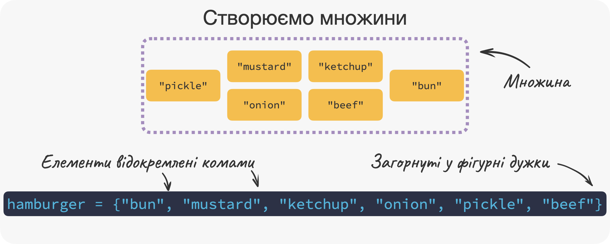
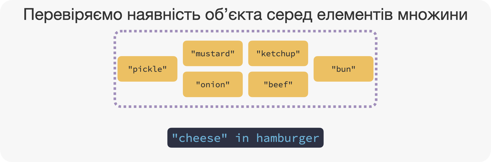
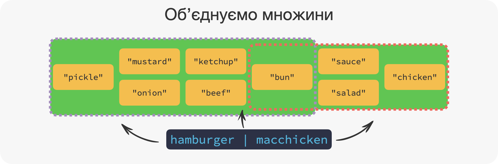
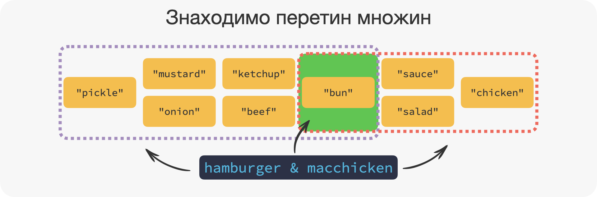
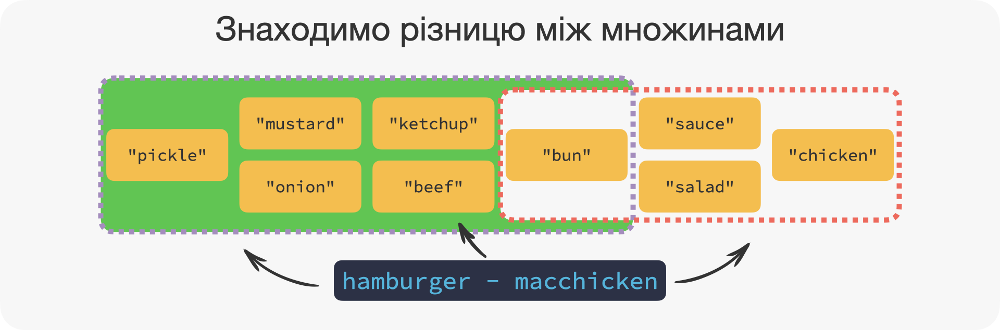
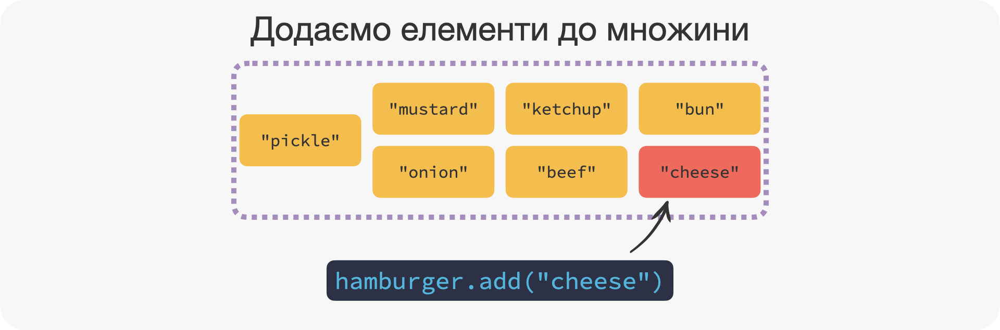
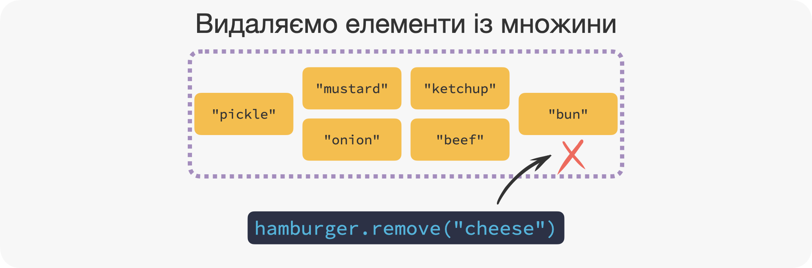

# Множини `set`

<div class="btn-group">
  <button class="lecture" disabled>🎥 Лекція</button>
  <button class="podcast" disabled>🎙️ Подкаст</button>
  <button class="notebook">📓 Записник</button>
  <button class="exercises" onclick="openDetailsById('set_exercises');">🤸 Вправи</button>
  <button class="cheat" disabled>📝 Шпора</button>
</div>

**⏱️ Час на опанування теми:** 25 хвилин

**🤷 Для чого ми це вивчаємо:**

- опанувати структуру даних створену для неупорядкованих елементів
- завершити вивчення структур даних

**🔑 Результати навчання:**

- створювати множини `set`
- перевіряти чи містяться елементи у множині
- додавати та видаляти елементи
- отримувати об'єднання, перетин та різницю двох множин

```{r, echo=FALSE, message=FALSE, warning=FALSE, error=TRUE}
#-------------------------------------------------------------------------------
# Code below is for knit caching purposes

library(reticulate)
library(jsquiz)
source("term.R")

# set up all messages 
set_button_label("Перевірити")
set_placeholder("Пишіть тут...")
set_success_messages(
    c(
        "Так тримати, чемпіон 🌟",
        "Просто супер 🤩",
        "Ти -- молодец 😎",
        "Йой, бачу довідченого кодера 🤓",
        "А ти точно не прцював в OpenAI до цього 🤖"
    )
)
set_failure_messages(
    c(
        "Упс, ще трошки 😬",
        "Це не зовсім те, що ми мали на увазі, але вже близько 🙊",
        "Ти ще на один крок ближче до успіху, тільки не здавайся 🚀",
        "Нічого, головне не здаватися 💪"
    )
)
```

---

Множина `set` -- це `r term("неупорядкована", "unordered")` сукупність унікальних об'єктів. Якщо простіше -- це як `list`, але **без індексів** та тільки з **унікальними** елементами. Ми також можемо представити собі множини `set` як словники `dict`, в яких є тільки ключі 🔑 без значень. Давайте трохи зануримось у тему множин.

---

## 🧳 Створюємо множини

Пам'ятаєте як створити список `list`? Тоді ви вже майже знаєте як створити множини. Замість квадратних дужок (`[` та `]`) використайте фігурні (`{` та `}`), і це створить множину. Давайте створимо множину інгредієнтів гамбургера з МакДональдз. Це `"bun"` (булочка 🥯), `"mustard"` (гірчиця 🟡), `"ketchup"` (кетчуп 🔴), `"onion"` (цибуля 🧅), `"pickle"` (маринований огірок 🥒) та `"beef"` (яловичина 🥩):

```{python}
hamburger = {"bun", "mustard", "ketchup", "onion", "pickle", "beef"}
hamburger
```

```{r, echo=FALSE, out.width="100%"}

```

До речі якби ми два рази зазначили `"beef"`, то словник все одно залишився б таким же. Тому що в словниках можуть бути тільки унікальні елементи, тобто без повторень. Давайте спробуємо:

```{python}
hamburger = {"bun", "mustard", "ketchup", "onion", "pickle", "beef", "beef"}
hamburger
```

До речі, як і ключі 🔑 в словниках `dict`, елементами множин `set` можуть бути тільки незмінні об'єкти, такі як `int`, `float`, `str`, `bool`, `tuple` тощо. 

Давайте ще створимо множину, яка міститиме інгредієнти МакЧікен 🍗. Нам ця множина знадобиться трохи згодом. Назвемо цей об'єкт `macchicken`: 

```{python}
macchicken = {"bun", "sauce", "salad", "chicken"}
macchicken
```

## ➕ Застосовуємо оператори

Оператори дуже важливі для множин `set` і вони є, так би мовити, основною їх фішкою. Ми почнемо вже з відомого оператора `in`, а потім перейдемо до математичних операторів.

### Перевіряємо наявність об'єкта серед елементів множини

Як і в трьох попередніх типах, множини `set` мають оператори `in` та `not in`, які дозволяють перевірити чи входить елемент в множину. Давайте перевіримо, чи є `"cheese"` (сир 🧀) серед інгредієнтів гамбургера:

```{python}
"cheese" in hamburger
```

Звичайнісінько ж ні (`False`)! Тоді б це був вже чизбургер 🍔.^[До речі, автор цієї книги є запеклим шанувальником саме чизбургерів 🍔. Він пам'ятає часи коли він навчався в школі, і чизбургери 🍔 в МакДональдз коштували 2.50 ₴.]

```{r, echo=FALSE, out.width="100%"}

```

### Об'єднуємо множини

`r term("Об'єднанням", "union")` двох множин є множина, елементами якої є елементи з обох множин. Об'єднання здійснюється за допомогою оператора `|`.

У нашому прикладі з бургерами, це будуть усі інгредієнти які містяться в гамбургері та усі інгредієнти які містяться в МакЧікені:

```{python}
hamburger | macchicken
```

```{r, echo=FALSE, out.width="100%"}

```

### Знаходимо перетин множин

`r term("Перетин", "intersection")` двох множин -- це ті елементи, які присутні в обох множинах. У Python він реалізований за допомогою оператора `&`.

Це ті інгредієнти, які містяться і в гамбургері і в МакЧікені (тобто тільки булочка): 

```{python}
hamburger & macchicken
```

```{r, echo=FALSE, out.width="100%"}

```

### Знаходимо різницю між множинами

`r term("Різницею", "difference")` називаються ті елементи, які входять до множини першого операнду, але **не** входять до множини другого операнда: 

Різниця між `hamburger` та `macchicken`, це інгредієнти які є в гамбургері, але яких нема у МакЧікен:

```{python}
hamburger - macchicken
```

```{r, echo=FALSE, out.width="100%"}

```

## 🪛 Застосовуємо корисні методи

Традиційно, ми почнемо з того як додавати та видаляти елементи з множини `set`. 

### Додаємо елементи до множини

Для того, щоб додати елемент до множини, ми можемо використати метод `.add()`. Новий елемент треба буде зазначити між дужками. Додаємо `"cheese"` до множини `hamburger`:

```{python}
hamburger.add("cheese")
hamburger
```

```{r, echo=FALSE, out.width="100%"}

```

### Видаляємо елементи із множини

Так, сир не повинен бути у множині `hamburger`. Ми можемо його видалити двома методами: `.remove()` чи `.pop()`. Різниця у тому, що `.pop()` ще й поверне значення видаленого елементу, після того, як його видалить. Ми ж скористаємось `.remove()`:

```{python}
hamburger.remove("cheese")
hamburger
```

```{r, echo=FALSE, out.width="100%"}

```

Якщо такого елемента не існує, то методи повернуть помилку: 

```{python, eval = FALSE}
hamburger.remove("cheese")
```

```
Traceback (most recent call last):
  File "<stdin>", line 1, in <module>
KeyError: 'cheese'
```

### Методи, які еквівалентні операторам 

Математичні оператори які ми розглянули, тобто об'єднання `|`, перетин `&` та різниця `-`, також реалізовані як методи. Замість того щоб написати `a | b`, ми можемо записати цей вираз як `a.union(b)`. Цей вираз не змінить `a`, а поверне нову множину, яка дорівнюватиме `a | b`. Використовуючи множини `hamburger` та `macchicken`, маємо:

```{python}
hamburger.union(macchicken)
```

Нижче ми покажемо таблицю відповідності методів до операторів: 

|  Оператор  |  Метод              |
|------------|---------------------|
| `a | b`    | `a.union(b)`        |
| `a & b`    | `a.intersection(b)` |
| `a - b`    | `a.difference(b)`   |

---

Йой, ти взагалі розумієш, що зараз сталося? Ми не просто навчились тільки що створювати множини `set` та працювати з їх елементами. Ні! Опанувавши множини `set`, ми звершили величезний блок зі структур даних 😎 Це велика перемога 👏, і тепер головне не зупинятись! 

---

<details id="set_exercises">
<summary>🤸 Вправи</summary>

```{r, results='asis', message=FALSE, echo=FALSE}
generate_options_quiz(
    question = "1. Як створити множину?",
    answers = c(
        "<code>x = [1, 2, 3]</code>" = FALSE,
        "<code>x = {1, 2, 3}</code>" = TRUE,
        "<code>x = (1, 2, 3)</code>" = FALSE
    ),
    allow_multiple_answers = FALSE
)
```

```{r, results='asis', message=FALSE, echo=FALSE}
generate_arrange_quiz(
    question = "2. Перетягніть символи коду у правильному порядку, щоб знайти перетин множин <code>A</code> та <code>B</code>:",
    elements = c(
        "<code>B</code>" = 3,
        "<code>A</code>" = 1,
        "<code>&</code>" = 2
    )
)
```

```{r, results='asis', message=FALSE, echo=FALSE}
generate_short_quiz(
    question = "3. Напищіть код, що додає елемет <code>12</code> до множини <code>grades</code>:",
    correct_answer = "grades.add(12)"
)
```

```{r, results='asis', message=FALSE, echo=FALSE}
generate_bucket_quiz(
    question = "4. Перетягніть структури даних до правильної корзини:",
    elements = c(
        "<code>list</code>" = "Можна змінити",
        "<code>tuple</code>" = "Не можна змінити",
        "<code>dict</code>" = "Не можна змінити",
        "<code>set</code>" = "Не можна змінити"
    ),
    buckets = c("Можна змінити", "Не можна змінити")
)
```

```{r, results='asis', message=FALSE, echo=FALSE}
generate_options_quiz(
    question = "5. Оберіть правильні твердження щодо множин <code>set</code>:",
    answers = c(
        "Множини містять ключі та значення" = FALSE,
        "Множини містять лише унікальні елементи" = TRUE,
        "Множини можуть містити безліч різних значень" = FALSE,
        "Множини - це як словники без ключів" = FALSE
    ),
    allow_multiple_answers = TRUE
)
```

```{r, results='asis', message=FALSE, echo=FALSE}
generate_options_quiz(
    question = "6. Щоб створити множину потрібно використовувати:",
    answers = c(
        "Фігурні дужки" = TRUE,
        "Квадратні дужки" = FALSE,
        "Круглі дужки" = FALSE,
        "Дужки не потрібні" = FALSE
    ),
    allow_multiple_answers = FALSE
)
```

```{r, results='asis', message=FALSE, echo=FALSE}
between <- "<pre><code>## {'Dnipro', 'Kharkiv', 'Kyiv', 'Lviv', 'Odesa'}</code></pre>
<div class='question'>Оберіть правильну відповідь:</div>"

generate_options_quiz(
    question = "7. Як правильно створити множину, щоб отримати такий результат?",
    between = between,
    answers = c(
        '<code>uacities = {"Kyiv", "Lviv", "Odesa", "Kharkiv", "Dnipro"}</code>' = TRUE,
        '<code>uacities = {"Kyiv", "Lviv", "Dnipro", "Dnipro", "Odesa", "Kharkiv", "Kharkiv" ,"Lviv" , "Dnipro"}</code>' = TRUE,
        '<code>uacities = ["Dnipro", "Kharkiv", "Kyiv", "Lviv", "Odesa"]</code>' = TRUE,
        'Жоден варіант не є правильним' = FALSE
    ),
    allow_multiple_answers = TRUE
)
```

```{r, results='asis', message=FALSE, echo=FALSE}
generate_options_quiz(
    question = "8. <code>'Lviv' in uacities</code> перевірить, чи є Львів серед українських міст:",
    answers = c(
        "Так" = TRUE,
        "Ні" = FALSE
    ),
    allow_multiple_answers = FALSE
)
```

</details>
